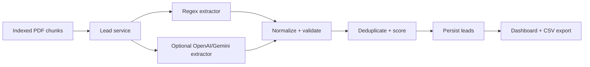

# Phase 6 - Lead Extraction Engine

## Implemented

- Hybrid lead extraction pipeline in `backend/ai_pipeline/lead_extractor.py`.
- Regex extraction for emails, phone numbers, websites, and LinkedIn URLs.
- Optional OpenAI or Gemini structured extraction when API keys are configured.
- Lead normalization, email validation, deduplication, intent keyword detection, and confidence scoring.
- SQLAlchemy lead storage with contact, company, designation, location, web, intent, source text, and confidence fields.
- JWT-protected lead APIs for extraction, listing, detail, deletion, and CSV export.
- Automatic lead extraction after successful document indexing.
- Frontend leads API client.
- Modern lead dashboard with summary cards, search, company filter, pagination, confidence badges, CSV export, deletion, empty states, loading skeletons, and toast feedback.
- Lead details modal with source text and copy actions.

## Architecture Overview

The extractor is intentionally layered:

1. Regex pass captures deterministic contact data.
2. Optional LLM pass enriches structured fields without blocking local/offline usage.
3. Normalization validates emails, cleans labels, normalizes URLs and phones, and detects intent.
4. Deduplication merges contacts by email, LinkedIn, phone, or name/company.
5. Scoring assigns confidence based on contact completeness and enrichment quality.

The service layer owns database writes, CSV export, pagination, and automatic dedupe against existing leads for the same document.

## Extraction Flow

## API Endpoints

- `POST /api/leads/extract` extracts leads for an indexed document.
- `GET /api/leads` returns paginated leads with summary metrics and company filters.
- `GET /api/leads/:leadId` returns one lead.
- `DELETE /api/leads/:leadId` removes one lead.
- `GET /api/leads/export/csv` exports all user leads as CSV.

## Future Improvements

- Background job queue for large document extraction.
- Human review workflow for low-confidence leads.
- CRM sync to HubSpot, Salesforce, or Airtable.
- Organization/team-level lead ownership.
- Source-page highlighting in the PDF viewer.
